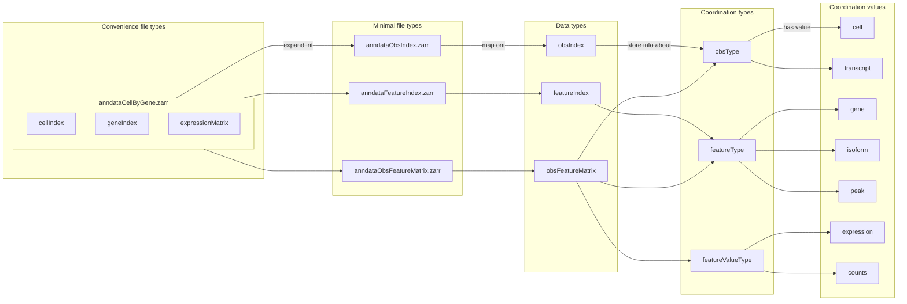

```mermaid
flowchart LR
    
    anndataCellByGene.zarr--expand into-->anndataObsIndex.zarr
    anndataCellByGene.zarr-->anndataFeatureIndex.zarr
    anndataCellByGene.zarr-->anndataObsFeatureMatrix.zarr
    subgraph Convenience file types
    subgraph anndataCellByGene.zarr
    cellIndex
    geneIndex
    expressionMatrix
    end
    end
    subgraph Minimal file types
    anndataObsIndex.zarr
    anndataFeatureIndex.zarr
    anndataObsFeatureMatrix.zarr
    end
    anndataObsIndex.zarr--map onto-->obsIndex
    anndataFeatureIndex.zarr-->featureIndex
    anndataObsFeatureMatrix.zarr-->obsFeatureMatrix
    subgraph Data types
    obsIndex
    featureIndex
    obsFeatureMatrix
    end
    obsIndex--store info about-->obsType
    featureIndex-->featureType
    obsFeatureMatrix-->obsType
    obsFeatureMatrix-->featureType
    obsFeatureMatrix-->featureValueType
    subgraph Coordination types
    obsType
    featureType
    featureValueType
    end
    obsType--has value-->cell
    obsType-->transcript
    featureType-->gene
    featureType-->isoform
    featureType-->peak
    featureValueType-->expression
    featureValueType-->counts
    subgraph Coordination values
    cell
    transcript
    gene
    isoform
    peak
    expression
    counts
    end
```
